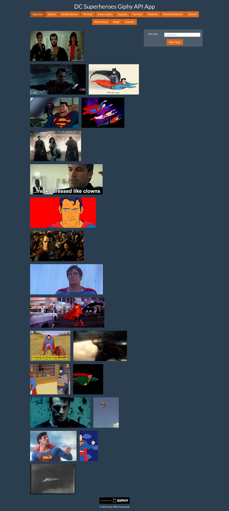

# Giphy API Project
## Description
Practice working with json data, querying API's on the giphyapi site using ajax.  Dynamically create html elements, (buttons, imgs, etc).  Also, this site employs both start and stop animate functions on clicking the generated gif's. User can also add a new button based on text entered in the 'Add a topic' section, and ping the giphy api with that button.

## View App on Heroku
[giphyAPI](https://jmmarquardt-giphy.herokuapp.com/)

## Screenshot

## Technologies Used
* HTML
* CSS
* JavaScript
* jQuery
* Bootstrap
* Ajax
* Giphy API 

## Author
&copy; 2016 John-Mike Marquardt [Github](https://github.com/codemarq) | [jmmarquardt.com](https://jmmarquardt.com) | [LinkedIn](https://www.linkedin.com/in/jmmarquardt)